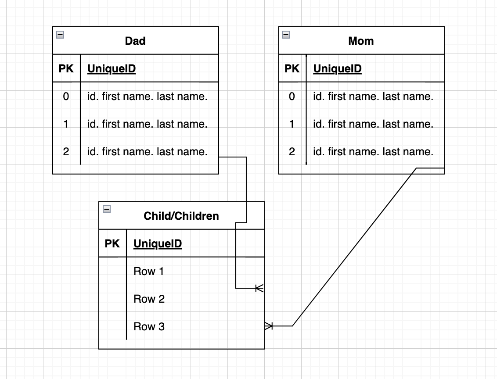
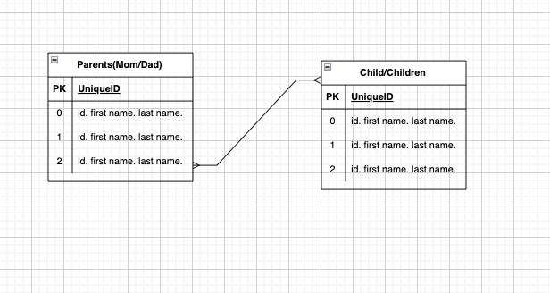
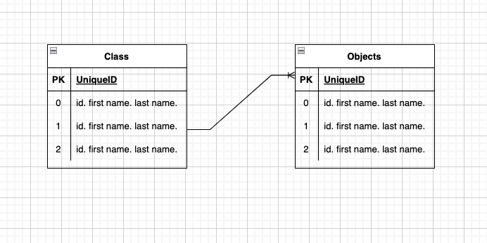

# Relations HW

// pets and owners

- pets to owners: many to many
- owners to pets: many to many

// blog posts and authors

- blog posts to authors: many to one
- authors to blog posts: one to many

// teachers and students (per class)

- teachers to students: one to many
- students to teacher: many to one

// parents and children

- parents and children: many to many
- children and parents: many to many

// classes and objects

- classes and objects: one to many
- objects and classes: many to one

// projects and contributors (one project)

- projects and contributors: one to many
- contributors and projects: many to one
